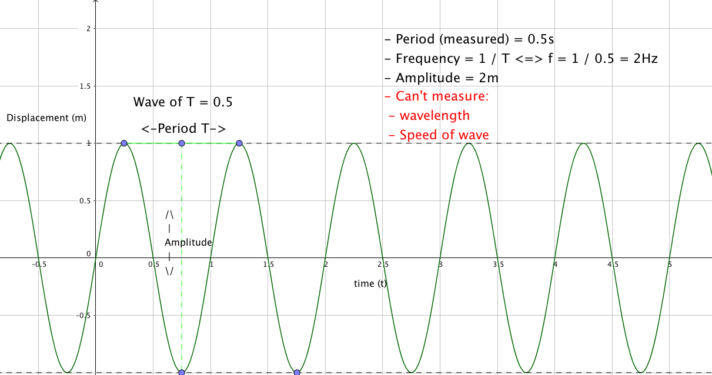
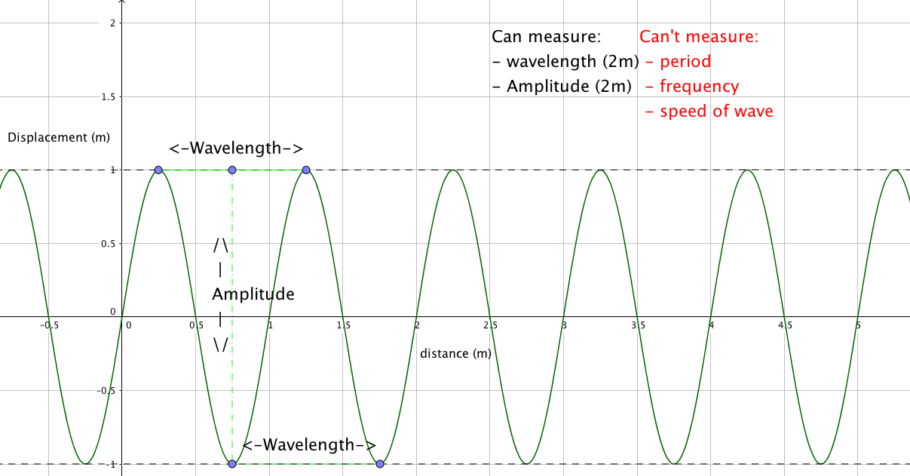
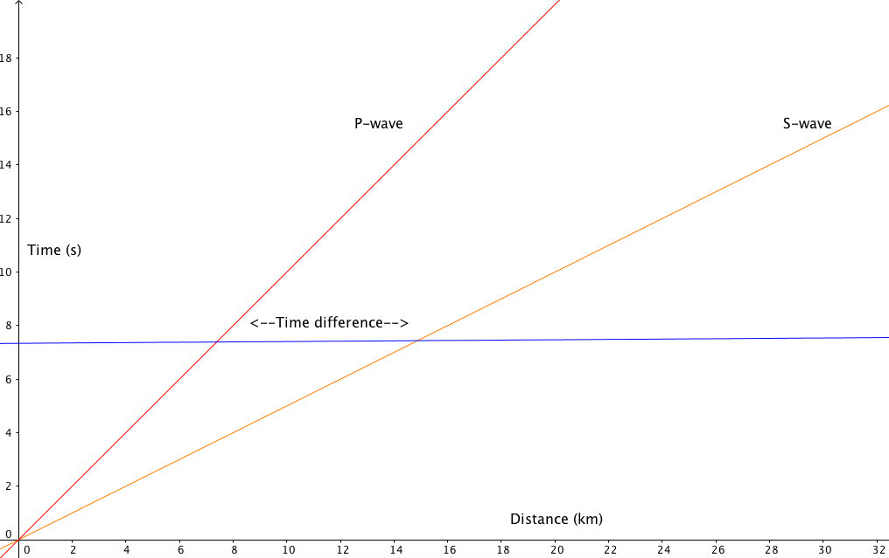
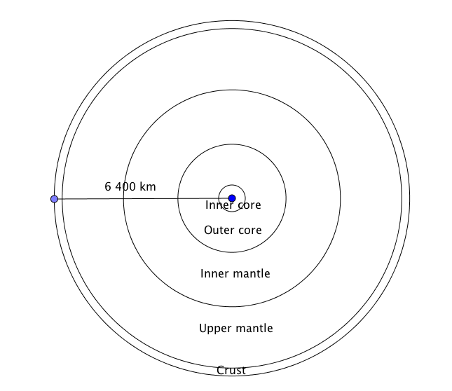
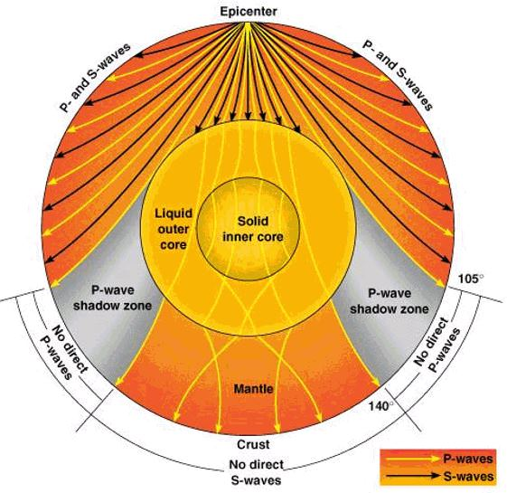

# Waves

A wave transfers energy over-space via the oscillation of a medium. It can be characterized by

- amplitude (m)
- speed (m/s)
- wavelength (m)
- period (s)
- frequency (Hz)

**Transverse wave**: oscillation of particles <del>up and down</del> **perpendicular** to the direction of the energy  
**Longitudinal waves**: oscillation of particles **parallel** to the direction of the energy  

### Practice
Get 5 waves  
Read oscilloscope screen, find time for 5 waves, divide by 5   
=> period  

	f = 1 / T

Read oscilloscope screen  
**Period of a wave** (T): time for 1 complete cycle (seconds)  
**Frequency** (f): number of waves per second (Hertz)  

	f = 1 / T
	T = 1 / f

	A(t) = Amax * sin(2π f * t)
	
## Displacement and time graphs

A graph that plots the positions over time of just 1 particle in the wave (its displacement from its equilibrium position).  

				^
				|
	displacement|
				|
				|
				- - - - - ->
					Time

### [displacement against time:](Source/wave.ggb)

### [displacement against meter:](Source/wave2.ggb)

## Wave equation
- Speed of wave *`v`* **[m/s]**
- Amplitude *`A`* **[m]**
- Frequency *`f`* **[Hz]**=**[1/s]**
- Wavelength *`λ`* **[m]**
- Period *`T`* **[s]**  

**Speed of wave**:

	v = λ * f = λ / T
	
### Finding the epicenter of an earthquake

1. Use the wave speeds to graph distance from epicenter of each wave against time. 
2. Find the distance at which each wave arrives with the time difference observed. 

(Note: **time should be on the x-axis**, and distance on the y-axis)

## Analytical
### [Exercise](Source/Earthquakeactivity.pdf)

Speed P -> vp = 12 km / s  
Speed S -> vs = 6 km / 2  

Dp = vp * tp  
Ds = vs * ts

ts - tp = 360  
ts = 360 + tp

At Pakodilla, Dp = Ds = x  
vp * tp = vs * ts  
vp * tp = vs * (tp + 360)

12 tp = 6 (tp + 360)  
=>t p = 360

Dp = vp * tp = 12 * 360 = **4320 km**

1. Write down what you know
2. Find relationships  
-> Vp = Dp / tp  
And ts - tp = the difference in times
3. Solve equations

## Application in Seismography

### Earthquake waves
**Primary** 

- compression wave
- both liquids + solids

**Secondary**

- shear / transverse waves
- solids not liquids

Shadow zones for both waves due to refraction and Earth's structure:

- 100 / 140º with focus at 0º
- S-wave shadow zone from 140 - 180º

